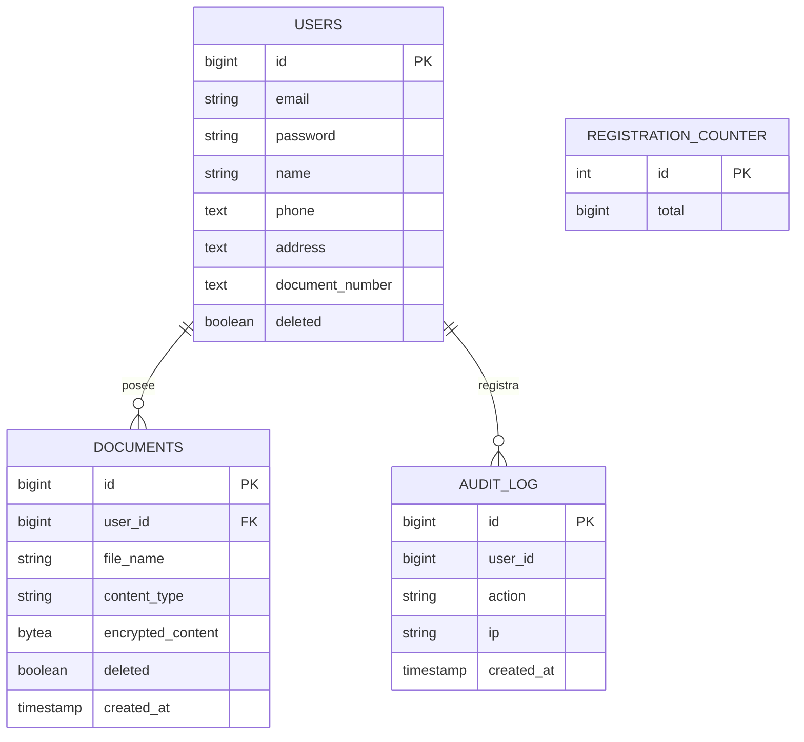

# Diagrama Entidad-Relación

```mermaid
erDiagram
  USERS ||--o{ DOCUMENTS : posee
  USERS ||--o{ AUDIT_LOG : registra
  USERS { bigint id PK string email string password string name text phone text address text document_number boolean deleted }
  DOCUMENTS { bigint id PK bigint user_id FK string file_name string content_type bytea encrypted_content boolean deleted timestamp created_at }
  AUDIT_LOG { bigint id PK bigint user_id string action string ip timestamp created_at }
  REGISTRATION_COUNTER { int id PK bigint total }
```
